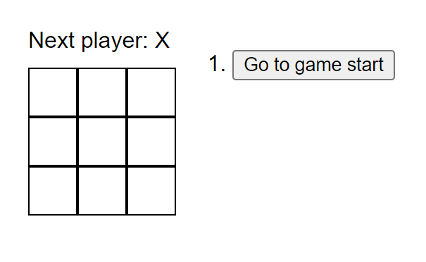
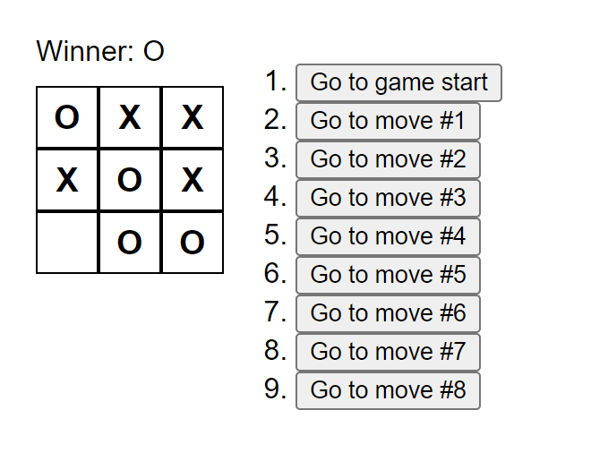

# Tentang Aplikasi
Tic Tac Toe adalah permainan dua pemain di mana pemain bergiliran menandai ruang dalam grid 3x3. Pemenang adalah pemain pertama yang berhasil menempatkan tiga tanda mereka dalam satu baris, baik secara horizontal, vertikal, atau diagonal.

</br>

# React + Vite

This template provides a minimal setup to get React working in Vite with HMR and some ESLint rules.

Currently, two official plugins are available:

- [@vitejs/plugin-react](https://github.com/vitejs/vite-plugin-react/blob/main/packages/plugin-react/README.md) uses [Babel](https://babeljs.io/) for Fast Refresh
- [@vitejs/plugin-react-swc](https://github.com/vitejs/vite-plugin-react-swc) uses [SWC](https://swc.rs/) for Fast Refresh
  
</br>


# ReactJS Project

Ini adalah proyek ReactJS yang menggunakan versi React 18.2.0 dan Node.js 20.13.1. Proyek ini menggunakan pnpm sebagai package manager.

</br>

## Persyaratan

Pastikan Anda telah menginstal perangkat lunak berikut sebelum memulai proyek ini:

- [Node.js](https://nodejs.org/) versi 20.13.1 atau lebih baru
- [pnpm](https://pnpm.io/) versi terbaru
  
</br>

## Instalasi

1. **Clone repositori ini:**

    ```sh
    git clone https://github.com/zendParadox/tic-tac-toe.git
    ```
    ```sh
    cd tic-tac-toe
    ```

2. **Install dependencies:**

    ```sh
    pnpm install
    ```

</br>

## Menjalankan Proyek

Untuk menjalankan proyek, gunakan perintah berikut:

```sh
pnpm start
```

Ini akan memulai server pengembangan dan membuka proyek di browser Anda. Biasanya, proyek akan terbuka di http://localhost:5173.

</br>

## Build Proyek

Untuk membuat build produksi, gunakan perintah berikut:

```sh
pnpm build
```

Ini akan menghasilkan folder build dengan versi produksi aplikasi Anda.

</br>

## Testing

Untuk menjalankan test suite, gunakan perintah berikut:

```sh
pnpm test
```

</br>

## Lisensi

Proyek ini dilisensikan di bawah MIT License.

</br>

## Demo Aplikasi


<br/>



